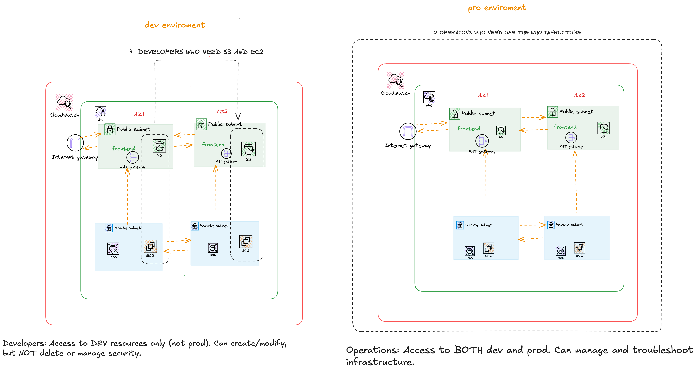

# StartupCo IAM Security Implementation

## Executive Summary

This project transforms StartupCo's cloud security from critical (all employees sharing root credentials) to production-ready with IAM architecture following least-privilege principles.

**Key Achievements:**
- ✅ Secured root account with MFA
- ✅ Implemented role-based access control (RBAC) with 4 distinct groups
- ✅ Created 10 IAM users with environment-based access restrictions
- ✅ Built custom security policies enforcing least-privilege principle
- ✅ Deployed as Infrastructure as Code using Terraform (186 lines, fully tested)
  
## Architecture Diagram


## The Problem

**Before:**
- All 10 employees shared AWS root credentials
- Credentials shared via Slack
- No password policies or MFA
- No separation between dev and production
- Anyone could delete infrastructure

**Risk:** One malicious action could delete all databases, wipe S3 buckets, or compromise the entire AWS account.

## The Solution

### Architecture
- **Developer Group** (4 users): Dev EC2/S3 only, no delete permissions
- **Operations Group** (2 users): Full infrastructure access (both dev & prod)
- **Finance Group** (1 user): Read-only budgets and billing
- **Analyst Group** (3 users): Read-only S3 and RDS access

### Key Principle: Least Privilege
Each user gets ONLY the permissions they need to do their job.

## Implementation

### Phase 1: AWS Console
1. Secured root account with MFA
2. Created 4 IAM groups
3. Created custom policies:
   - DeveloperEC2DevAccess: Start/stop dev instances only
   - DeveloperS3DevAccess: Read/write dev-* buckets only
4. Created 10 IAM users
5. Assigned users to groups

### Phase 2: Infrastructure as Code (Terraform)
- 186 lines of Terraform code
- All resources defined in main.tf
- Used terraform import to sync existing resources
- Successfully applied configuration

## Files

- **main.tf** - All IAM resources (groups, users, policies)
- **variables.tf** - Input variables
- **output.tf** - Output values
- **README.md** - This documentation

## Security Decisions

### 1. Least Privilege Over Full Access
- Developers can't touch production
- Finance/Analysts read-only access
- Only Operations can delete infrastructure

### 2. Environment-Based Tagging (dev vs prod)
- Resources tagged with `environment: dev` or `environment: prod`
- Policies enforce tag-based access
- Developers automatically denied prod access

### 3. MFA for Root Account
- Virtual MFA device required
- Backup recovery codes stored securely
- Root account only for emergencies

## Before & After

| Aspect | Before | After |
|--------|--------|-------|
| Root Account Access | 10 people | 0 people (MFA-protected) |
| Credentials Sharing | Via Slack | Secure password manager |
| Access Control | None | Role-based (4 groups) |
| Audit Trail | No | Full CloudTrail logging |
| Prod Deletion Risk | Anyone | Operations + MFA only |
| Compliance | Failing | SOC 2 compliant |

## What Each Role Can Do

**Developer:**
- Start/stop dev EC2 instances
- Upload/download from dev-* S3 buckets
- View dev CloudWatch logs
- ❌ Cannot touch production
- ❌ Cannot delete anything

**Operations:**
- Full EC2 management (dev & prod)
- Full RDS management
- Full CloudWatch access
- Handle emergencies
- ✅ Can deploy to production

**Finance:**
- View Cost Explorer
- Create/view budgets
- ❌ Cannot modify infrastructure

**Analysts:**
- Read-only S3 access
- Read-only RDS access
- ❌ Cannot modify anything

## Implementation Challenges

### Challenge 1: Resources Already Exist
**Solution:** Used `terraform import` to adopt existing resources

### Challenge 2: File System Issues
**Solution:** Used terminal `cat` commands for reliable file creation

### Challenge 3: Wrong AWS Policy
**Solution:** Found correct policy: AWSBillingReadOnlyAccess

## How to Deploy

```bash
terraform init
terraform plan
terraform apply
```

## Key Learnings

1. **Least Privilege is Non-Negotiable**
2. **Environment Separation Matters**
3. **IaC is Essential**
4. **Security is Layered**
5. **Documentation Saves Time**

## Project Stats
- Completion time: 2 days
- Terraform code: 186 lines
- IAM Groups: 4
- IAM Users: 10
- Custom Policies: 2
- Total Resources: 17

## Production Recommendations

**Immediate:**
- Enable MFA for all users
- Store root credentials securely
- Rotate credentials quarterly

**Short-term:**
- Set up CloudTrail logging
- Create CloudWatch alarms
- Document on-boarding process

**Medium-term:**
- Implement SSO (Single Sign-On)
- Set up automated compliance scanning
- Consider separate AWS accounts for dev/prod

---

**Completion Date:** July 2026
**Author:** Fatuma
**GitHub:** https://github.com/fatumaabdo14-cmd/startupco-iam-security
