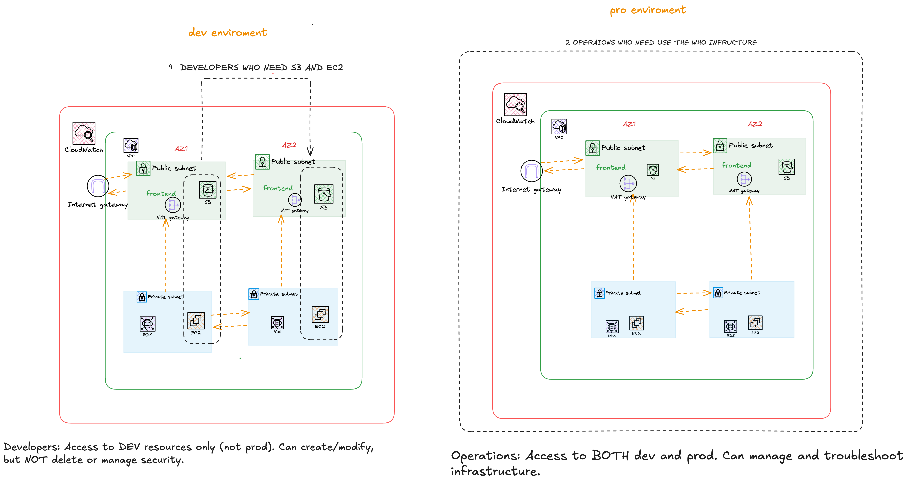

# StartupCo AWS Security Implementation


Hardening a fast-growing startup's AWS account in three phases: **Level 1** replaced shared root credentials with least-privilege IAM; **Level 2** moved sensitive access to temporary, MFA-protected roles and encrypted customer data with a customer-managed KMS key; **Level 3** enforced MFA for every IAM user and brought group permissions fully under Terraform.

---

## The Problem

StartupCo (10 employees, fitness tracking app) launched quickly on AWS. After three months:

- All 10 employees shared the **root account** credentials
- Credentials were shared over team chat
- No MFA, no password policy, no separation between teams
- Anyone could delete production infrastructure or read customer data

---

## Repository

| File | Purpose |
|---|---|
| `main.tf` | Groups, users, custom policies and group policy attachments (reflects Level 2 group permissions) |
| `mfa.tf` | Level 3: `Require_mfa` policy and its attachment to all four groups |
| `variables.tf` | Input variables |
| `output.tf` | Output values |
| `README.md` | This documentation |

**Deploy**

```bash
terraform init
terraform plan
terraform apply
```

---

## Level 1: Identity Foundation

| Change | Result |
|---|---|
| Root account secured with MFA, removed from daily use | 0 people use root day to day |
| 4 IAM groups (Developers, Operations, Finance, Analyst) | Role-based access control |
| 10 IAM users, each in one group | Individual accountability |
| Custom policies: `DeveloperEC2DevAccess`, `DeveloperS3DevAccess` | Developers limited to dev resources via `Environment` tags |
| Deployed with Terraform (`terraform import` to adopt existing resources) | IAM defined as code |

---

## Level 2: Least-Privilege Access and Data Protection

Level 1 controlled **who gets in**. Level 2 limits **what happens if an account is compromised**.

### 1. Assigned vs. Assumed Access

| | Assigned | Assumed |
|---|---|---|
| How | Policy attached to a user or group | User calls `sts:AssumeRole` to borrow a role |
| Duration | Always on | Temporary session, then expires |
| Credentials | Long-lived | Short-lived, issued by STS |
| Used for | Low-risk daily work | Production changes and customer data |

**Design rule:** anything that can change production or read customer data is **assumed, never assigned**.

### 2. Operations: Production Admin Role

**Role:** `StartupCo-OpsProdAdmin`

| Setting | Value |
|---|---|
| Trust policy | Principals in this account, **MFA required** |
| Permissions | `AmazonEC2FullAccess`, `AmazonRDSFullAccess`, `CloudWatchFullAccess`, `AmazonSSMFullAccess` |
| Max session | 1 hour |

**Operations group changes:**
- Removed full-access policies
- Attached read-only: `AmazonEC2ReadOnlyAccess`, `AmazonRDSReadOnlyAccess`, `CloudWatchReadOnlyAccess`
- Added inline policy `AllowAssumeOpsProdAdmin`: `sts:AssumeRole` scoped to the role's ARN only

**Result:** Ops can observe production every day, but must assume the role with MFA to change it. A stolen Ops password alone yields read-only access.

### 3. Analysts: Customer Data Role

**Role:** `StartupCo-AnalystData`

| Setting | Value |
|---|---|
| Trust policy | Principals in this account, **MFA required** |
| Permissions | `AmazonS3ReadOnlyAccess`, `AmazonRDSReadOnlyAccess` |
| Max session | 4 hours |

**Analyst group changes:**
- Removed S3 and RDS read-only policies
- Group now holds only `AllowAssumeAnalystData` (`sts:AssumeRole` scoped to the role's ARN)

**Result:** customer data is unreadable from an analyst's everyday credentials.

### 4. Verification: IAM Policy Simulator

A test passes when the real result matches the expected result. A **Denied** can be a pass: it proves a door is locked that should be locked.

**Operations role**

| Identity | Action | Resource | Expected | Result | Test |
|---|---|---|---|---|---|
| Operations group | `ec2:CreateTags` | `*` | Denied | Denied | ✅ Pass |
| Operations group | `sts:AssumeRole` | OpsProdAdmin ARN | Allowed | Allowed | ✅ Pass |
| Developers group | `sts:AssumeRole` | OpsProdAdmin ARN | Denied | Denied | ✅ Pass |
| OpsProdAdmin role | `ec2:CreateTags` | `*` | Allowed | Allowed | ✅ Pass |

**Analyst role**

| Identity | Action | Resource | Expected | Result | Test |
|---|---|---|---|---|---|
| Analyst group | `s3:GetObject` | `*` | Denied | Denied | ✅ Pass |
| Analyst group | `sts:AssumeRole` | AnalystData ARN | Allowed | Allowed | ✅ Pass |
| Developers group | `sts:AssumeRole` | AnalystData ARN | Denied | Denied | ✅ Pass |
| AnalystData role | `s3:GetObject` | `*` | Allowed | Allowed | ✅ Pass |

### 5. Encryption at Rest: KMS

| Resource | Configuration |
|---|---|
| KMS key | Customer-managed, symmetric, alias `startupco-user-data`, `us-west-1` |
| Key administrators | Account administrator (manages the key, separate from data use) |
| Key users | `StartupCo-AnalystData` |
| S3 bucket | `startupco-user-data-fatuma`, `us-west-1`, Block Public Access on |
| Default encryption | SSE-KMS with `startupco-user-data`, S3 Bucket Key enabled |

**Why a customer-managed key:** the key policy decides who can decrypt, every use is logged in CloudTrail, and the key can be disabled to cut off access to all encrypted data at once. Reading customer data now requires **both** S3 permission and KMS permission.

**Verified:** test object uploaded and confirmed as `SSE-KMS` with the `startupco-user-data` key ARN.

---

## Level 3: MFA Enforcement for All Users

Level 2 required MFA to assume privileged roles. Level 3 extends MFA to **every IAM user**, so a stolen password alone grants nothing beyond registering an MFA device.

### Policy: `Require_mfa`

| Statement | Effect | What it does |
|---|---|---|
| `AllowManageOwnMFA` | Allow | Create, enable, list and resync **own** MFA device; change own password; view own user. Scoped to `${aws:username}` |
| `DenyAllWithoutMFA` | Deny | Every action **except** the above (`NotAction`), whenever `aws:MultiFactorAuthPresent` is false or absent |

**Attached to:** Developer, Operations, Finance, Analyst (`mfa.tf`).

### Design Decisions

- **Explicit deny overrides every allow.** One policy secures all four groups without modifying their existing permissions.
- **Self-service exceptions prevent lockout.** A new user can register an MFA device before anything else is permitted.
- **`BoolIfExists`** treats a missing MFA flag as "no MFA," which also covers requests made with long-lived access keys.
- **Group-level attachment.** New users inherit enforcement automatically when added to a group.

### Verification

| Identity | Action | MFA context | Expected | Result | Test |
|---|---|---|---|---|---|
| finance-user-1 | `budgets:ViewBudget` | Absent | Denied | Explicit deny | ✅ Pass |
| finance-user-1 | `budgets:ViewBudget` | `true` | Allowed | Allowed | ✅ Pass |

Same identity, same action: the only variable is MFA. The second test was run from the CLI:

```bash
aws iam simulate-principal-policy \
  --policy-source-arn arn:aws:iam::<account-id>:user/finance-user-1 \
  --action-names budgets:ViewBudget \
  --context-entries "ContextKeyName=aws:MultiFactorAuthPresent,ContextKeyValues=true,ContextKeyType=boolean" \
  --query "EvaluationResults[].EvalDecision"
```

**Scope note:** enforcement is deployed to all groups. This is a single-operator lab account, so MFA devices were not registered for each of the 10 test users; enforcement behavior was validated with the IAM policy simulator.

---

## Implementation Challenges

**1. No dedicated customer-data bucket, resources split across regions.**
Existing buckets were CloudTrail logs, CDK bootstrap assets, Terraform state and unrelated projects, spread across `us-east-1` and `us-west-1`. Since KMS keys are regional and must match the bucket's region, I created a dedicated `startupco-user-data` bucket in `us-west-1` alongside the key. IAM is global, so the roles were unaffected. CDK bootstrap buckets were intentionally left untouched.

**2. Upload failed with `key ... is disabled`.**
The key had been disabled during region cleanup. Re-enabling it restored uploads, and it confirmed that S3 writes depend on the key's state. This is the same lever an incident responder would use to lock down data.

**3. Simulator results for `sts:AssumeRole` depend on the resource.**
With the resource left as `*`, AssumeRole evaluated as denied because the policy is scoped to a single role ARN. Supplying the exact role ARN produced the correct result. Least privilege works as intended.

**4. Configuration drift reverted Level 2 controls.**
Level 2 group changes were made in the console, while `main.tf` still described Level 1. `terraform apply` reconciles every file in the working directory, so applying the Level 3 configuration also re-attached the Operations full-access policies and the Analyst data policies. Detected with `aws iam list-attached-group-policies`; resolved by codifying the Level 2 group permissions in `main.tf` and re-applying (3 attachments added, 6 removed). Group permissions are now changed only through Terraform, and every apply is preceded by a reviewed `terraform plan`.

---

## Before and After

| Aspect | Before | After |
|---|---|---|
| Root account | Shared by 10 people | MFA-protected, emergency only |
| Access model | Everyone is admin | 4 groups, least privilege |
| MFA | None | Required for every IAM user |
| Production changes | Anyone, anytime | Ops only, via 1-hour MFA-protected role |
| Customer data access | Anyone | Analysts only, via 4-hour MFA-protected role |
| Customer data at rest | Unencrypted | SSE-KMS with customer-managed key |
| Group permissions | Manual | Managed in Terraform |
| Audit trail | None | CloudTrail; KMS key usage logged |
| Validation | None | 10 Policy Simulator tests + encryption test |

---

## Next Steps

- **Terraform:** codify the Level 2 roles (`StartupCo-OpsProdAdmin`, `StartupCo-AnalystData`), their inline `AssumeRole` policies, the KMS key and the bucket. Group permissions and MFA enforcement are already in code.
- **Remote state:** move Terraform state to an S3 backend with state locking.
- **Developer EC2 policy:** `ec2:DescribeInstances` does not support resource-tag conditions; split it into its own statement.
- **RDS encryption:** encrypt the database (snapshot, encrypted copy with KMS, restore).
- **Existing objects:** re-encrypt any objects stored before default encryption was enabled.
- **App server role:** EC2 instance role so the application never stores access keys.
- **Database-level access:** read-only database user for analysts. `AmazonRDSReadOnlyAccess` covers RDS configuration, not table data.
- **Longer term:** IAM Identity Center (SSO), separate dev and prod accounts with SCPs.

---

## Region Note

IAM is global. KMS key and customer-data bucket: **us-west-1 (N. California)**.